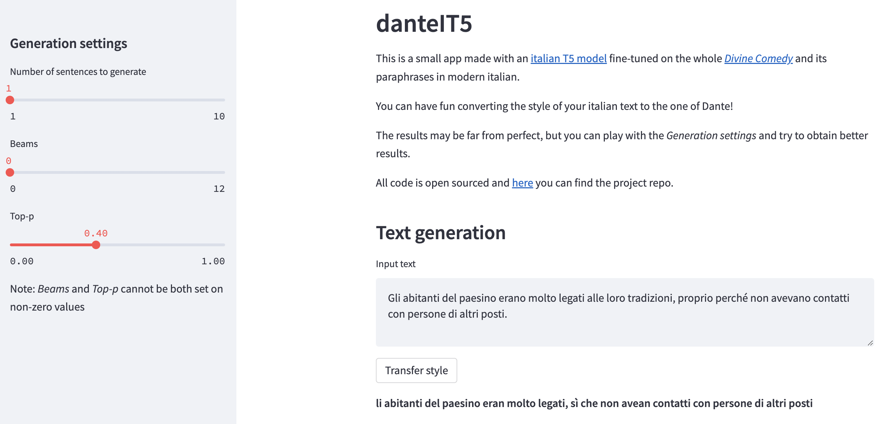

# danteIT5 - Text Style Transfer from italian to Dantean

Text Style Transfer (TST) is a task in which the *source style* of a text is changed to a chosen *target style*. The task aims to change the style of a given sentence while preserving its semantics.

Here I show how to fine-tune an [italian T5 model](https://huggingface.co/gsarti/it5-small) to perform TST from modern italian to dantean italian using a custom dataset called **ita2dante**.

The fine-tuned model can be tested using an [online app](https://leobertolazzi-danteit5-app-cloud-eng-8upuiq.streamlit.app/) made with [Streamlit](https://streamlit.io/).

The app looks like this:



To obtain better results, it is suggested to experiment with the "Generation settings". For simplicity, the only generation methods which can be used are *Beam search* and *Nucleus sampling*.

## Dataset
The **ita2dante** dataset contains all the sentences from Dante's [*Divine Comedy*](https://en.wikipedia.org/wiki/Divine_Comedy) along with paraphrases in contemporary italian (approximately 6k pairs in total). The data is scraped from [divinacommedia.weebly.com](https://divinacommedia.weebly.com/).

Here are the first three rows of the ita2dante dataset:

italian | dante
------------- | -------------
A metà del percorso della vita umana, mi ritrovai per una oscura foresta, poiché avevo smarrito la giusta strada  | Nel mezzo del cammin di nostra vita mi ritrovai per una selva oscura, ché la diritta via era smarrita
Ahimè, è difficile descrivere com'era quella foresta, selvaggia, inestricabile e tremenda, tale che al solo pensiero fa tornare la paura | Ahi quanto a dir qual era è cosa dura esta selva selvaggia e aspra e forte che nel pensier rinova la paura
È così spaventosa che la morte lo è poco di più | Tant’è amara che poco è più morte

## Installation
The code was developed using Python 3.8. To install the dependencies, run the following at the repo root:
```
$ python -m venv venv
$ source venv/bin/activate
$ pip install -r requirements.txt
```

## Run the fine-tuning
After installing the dependencies, to fine-tune IT5 on ita2dante, run:
```
$ python fine_tuning.py
```
An new folder called `model` will be created with the best model checkpoint in it.

## Run the app locally
After the fine-tuning, if you want to test the model through the app, run:
```
$ streamlit run app_local.py
```

## Cloud app
If you only want to try the model without fine-tuning it from scratch, you can browse to the cloud app [here (eng)](https://leobertolazzi-danteit5-app-cloud-eng-8upuiq.streamlit.app/) and [here (ita)](https://leobertolazzi-danteit5-app-cloud-ita-c2olq1.streamlit.app/). The cloud apps use an already fine-tuned model on the [Hugging Face Hub](https://huggingface.co/leobertolazzi/it5-small-dante).

## Limitations
The biggest limitation for this project is the size of the ita2dante dataset. In fact, it consists only of 6K sentences whereas [gsarti/it5-small](https://huggingface.co/gsarti/it5-small) has more than 70M parameters.

It would be nice to expand ita2dante with text and paraphrases from other medieval italian poets!
